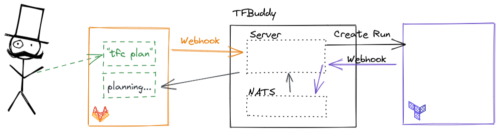

# TFBuddy

TFBuddy allows Terraform Cloud users to get apply-before-merge workflows in their Pull Requests.

## Terraform Cloud API Driven Runs

Terraform Cloud (TFC) has a native VCS integration that can trigger plans and applies based for repositories, however it
requires a merge after apply workflow that may not be desirable in some cases. This tool has been developed to enable a 
apply-before-merge workflow. 

### How it works

This tool provides a server function that processes webhooks from Gitlab/Github, triggers a Run in TFC for Merge/Pull Requests
and then passes status updates of those Runs back to the Merge/Pull Request in the form of comments.

### Architecture

TFBuddy consists of the webhook handler and a NATS cluster.

## Installation

### Helm

See [Installation Docs](https://tfbuddy.readthedocs.io/en/stable/usage/)

## Contributing

The [contributing](./docs/contributing.md) has everything you need to start working on TFBuddy.

## Documentation

To learn more about TF Buddy [go to the complete documentation](https://tfbuddy.readthedocs.io/).

---

Made by SRE Team @ 