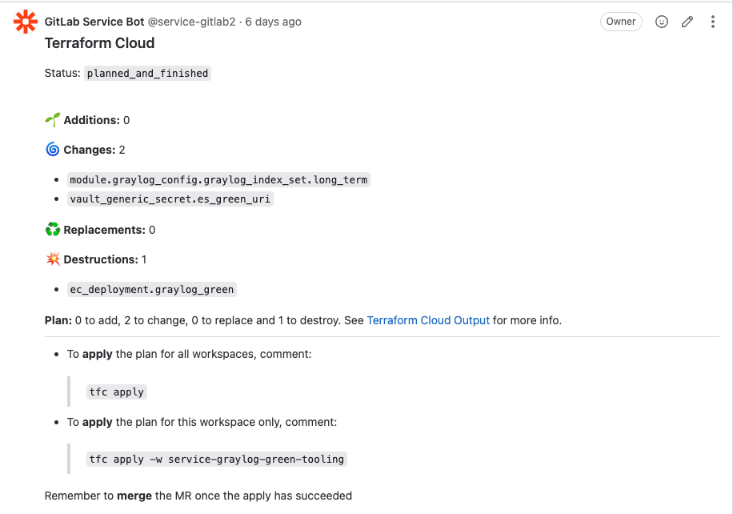
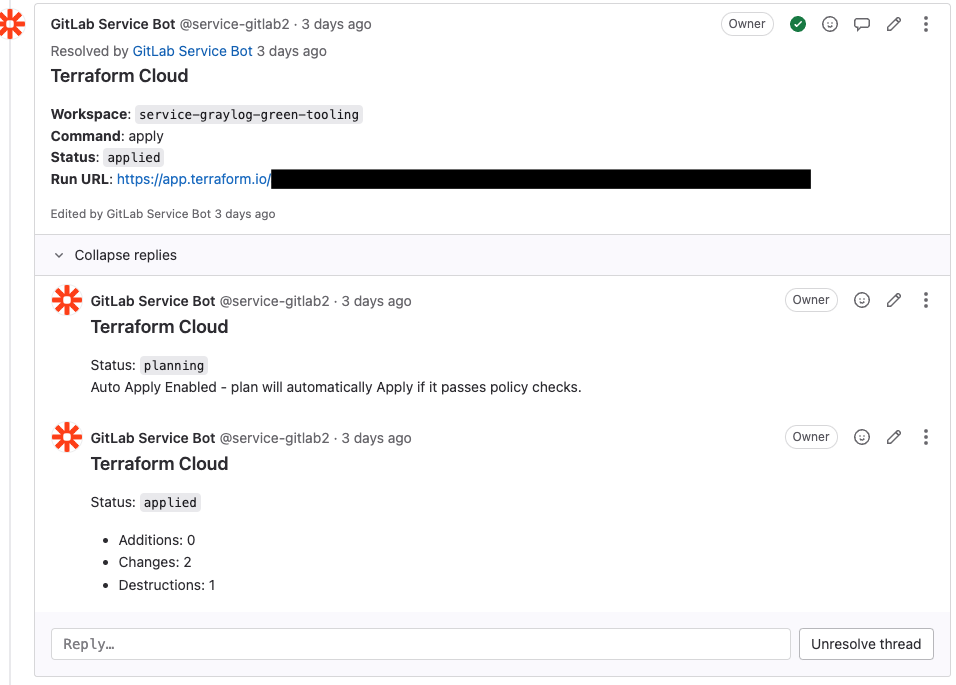
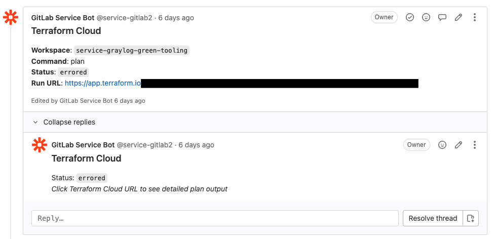

# Architecture

TFBuddy is driven by different webhook events from either a Terraform Cloud workspace or a supported VCS (GitHub/GitLab). These events are either user commands in the form of comments or changes in state (PR/MR being opened/closed).

## Overview


Once you have TFBuddy deployed, you need to register a webhook from each repo that you want TFBuddy to operate on. You also need to register a webhook from each Terraform Workspace that you want TFBuddy to interact with. Once that's configured, TF buddy will kick into action when you open a new PR. TF Buddy will then execute a speculative plan against the branch and will report back the plan in detail.



If you're happy with the plan, you can issue an apply command `tfc apply` or if you're operating on multiple workspaces, you can target a specific workspace `tfc apply -w workspace_name`. TFBuddy will verify that the PR is approved if that's required on your repo. It will also reject any `apply` attempts if the branch has conflicts. Once the `apply` starts, TFBuddy will provide a link to the run in Terraform Cloud for you to follow along with.



Once the `apply` has completed, TFBuddy will update the PR/MR indicating what was changed and if there were any errors.

Example of how an error is reported



A more detailed error message is provided if the error occurred within TFBuddy. If the error occurred during `terraform plan` or `terraform apply` it will not contain a detailed message. Instead, the run link will take you to the Terraform workspace where you can debug the error.

### Webhook Management

At Zapier, we automate the creation of all relevant webhooks by leveraging Terraform to create them. The example below is a resource we use to hook up a Gitlab project and a Terraform Cloud workspace to TFBuddy.

```terraform
resource "gitlab_project_hook" "tfbuddy" {

  project = "project"
  url     = var.tfbuddy_gitlab_webhook_url

  enable_ssl_verification = true

  merge_requests_events = true
  note_events           = true
  push_events           = true

  token = var.tfbuddy_gitlab_webhook_token
}

resource "tfe_notification_configuration" "tfbuddy" {

  name             = "tfbuddy"
  enabled          = true
  destination_type = "generic"
  triggers = [
    "run:created",
    "run:planning",
    "run:errored",
    "run:needs_attention",
    "run:applying",
    "run:completed"
  ]
  url          = var.tfbuddy_tfc_webhook_url
  workspace_id = "workspace_id"
}
```
