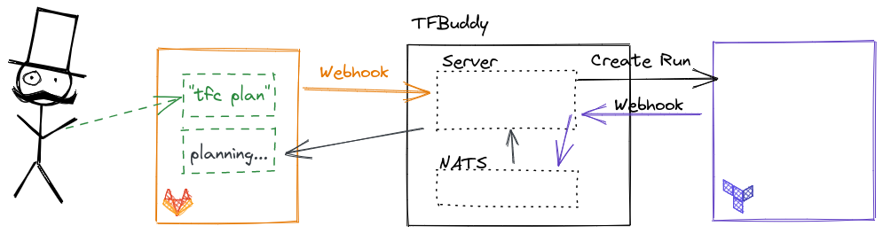
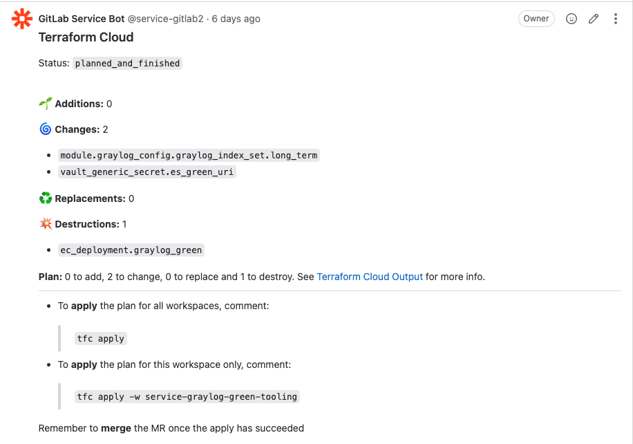
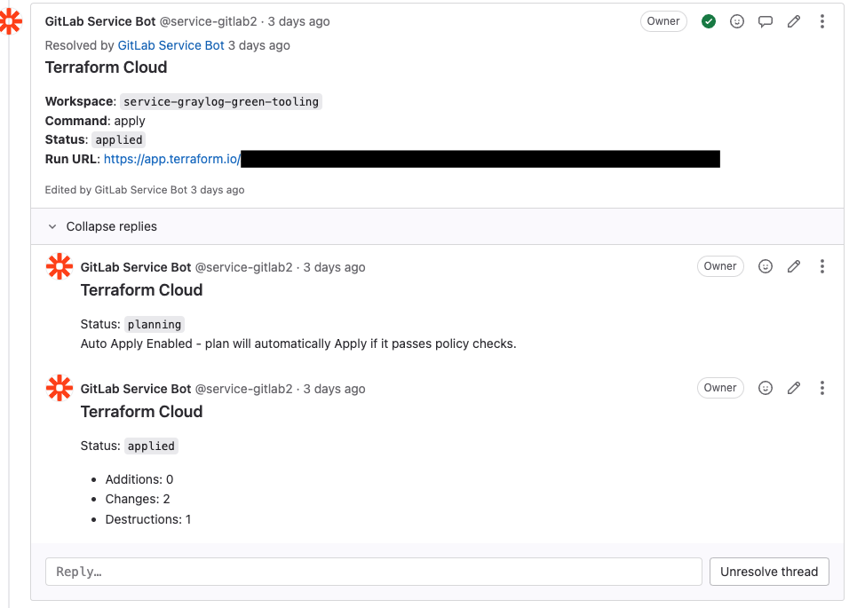
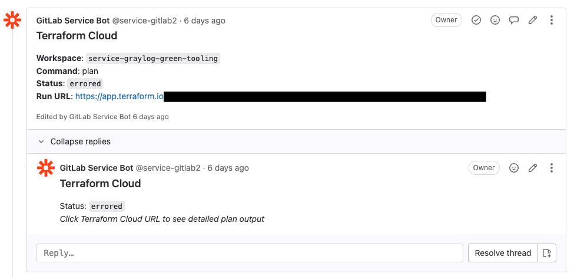

# Architecture

TF Buddy is driven by different webhook events from either a Terraform Cloud workspace, or a supported VCS (Github/Gitlab). These events are either user commands in the form of comments, or changes in state (PR being opened/closed).

## Overview



Once you have TF Buddy deployed you need to register a webhook from each repo that you want TF Buddy to operate on. You also need to register a webhook from each Terraform Workspace that you want TF Buddy to interact with. Once that's configured TF buddy will kick into action when you open a new PR. TF Buddy will then execute a speculative plan against the branch and will report back the plan in a detailed manner.



If you're happy with the plan you can issue a apply command `tfc apply` or if you're operating on multiple workspaces you can target a specific workspace `tfc apply -w workspace_name`. TF Buddy will verify that the PR is approved if that's required on your repo. It will also reject any applies if the branch has conflicts. Once the apply starts TF Buddy will provide a link to the run in Terraform Cloud for you to follow along with.



Once the apply completes TF Buddy will update the PR indicating what was changed and if there was any errors.

#### Comment Cleanup

When `TFBUDDY_DELETE_OLD_COMMENTS` is set, TFBuddy automatically cleans up old discussion threads to keep MRs/PRs readable. Each comment is tagged with an invisible HTML marker identifying its workspace and action (plan or apply). When a new run completes, TFBuddy deletes older discussions that match the same workspace and action, keeping only the latest one. This is workspace-scoped: if your MR triggers runs in multiple workspaces, each workspace retains its own most recent plan and apply comment independently. Previous run URLs are collected into a collapsible "Previous TFC Urls" table on the latest comment.

Example of how an error is reported



A more detailed error message is provided if the error occurred within TF Buddy. If the error occurred during terraform plan or terraform apply it will not contain a detailed message. Instead the run link will take you to the Terraform workspace where you can debug the error.


### Workspace Fan-Out

When an MR/PR touches several Terraform workspaces, TFBuddy splits the work onto a dedicated NATS JetStream queue and processes each workspace independently. The MR/PR webhook subscriber clones the repo once, evaluates which workspaces are blocked by changes on the target branch, and publishes one fan-out message per remaining workspace. A separate workspace worker drains the queue, with each delivery getting its own `AckWait` window — a slow workspace can no longer hold the parent message past `AckWait` and trigger a redelivery (which previously caused duplicate runs).

Per-workspace state (discussion ID, root note ID) is local to the worker invocation, so concurrent deliveries cannot leak IDs across workspaces.

The fan-out is gated by `TFBUDDY_WORKSPACE_FANOUT_ENABLED` (default `true`). Setting it to `false` falls back to the legacy inline per-MR loop, useful if you need to roll back at runtime without redeploying.

Each fan-out message carries the upstream webhook delivery ID (`X-GitHub-Delivery` for GitHub, `X-Gitlab-Event-UUID`/`Idempotency-Key` for GitLab). That ID combined with the workspace name is used as the JetStream dedup key, so a single webhook fanning out to N workspaces produces N distinct keys, while a legitimate retrigger (a new push or comment within the dedup window) carries a fresh delivery ID and is *not* swallowed by the dedup window.

Target-branch evaluation runs once in the publisher, so the MR-level "could not evaluate target branch" warning is posted at most once per delivery. Each worker then re-clones the repo to upload the workspace directory to TFC, so an MR touching N workspaces still does N+1 clones in fan-out mode. On large monorepos this measurably increases git egress and per-message latency; mitigate via `TFBUDDY_GITHUB_CLONE_DEPTH` / `TFBUDDY_GITLAB_CLONE_DEPTH`, or disable fan-out (`TFBUDDY_WORKSPACE_FANOUT_ENABLED=false`) and accept the AckWait risk.

The workspace stream exposes the same `consumers >= 1` liveness check as the other streams, wired into `/live` so a stuck or unsubscribed worker is caught by Kubernetes probes rather than silently piling up unprocessed messages.

### TFC API Rate Limiter

The TFC API client wraps its HTTP transport with a token-bucket rate limiter (`TFBUDDY_TFC_RATE_LIMIT_RPS`, default `30`; burst `TFBUDDY_TFC_RATE_LIMIT_BURST`, default `30`) so concurrent workspace workers cooperatively stay under TFC's documented per-token limit. The client deliberately has no top-level `Timeout`: `ConfigurationVersions.Upload` streams the cloned repo and a fixed cap would truncate slow uploads on large repos. Per-call deadlines flow through `context.Context`.

### Webhook Management

At Zapier we automate the creation of all relevant webhooks by leveraging Terraform to create them. The example below is a resource we use to hook up a Gitlab project and a Terraform Cloud workspace to TF Buddy.

```terraform
resource "gitlab_project_hook" "tfbuddy" {

  project = "project"
  url     = var.tfbuddy_gitlab_webhook_url

  enable_ssl_verification = true

  merge_requests_events = true
  note_events           = true
  push_events           = true

  token = var.tfbuddy_gitlab_webhook_token
}

resource "tfe_notification_configuration" "tfbuddy" {

  name             = "tfbuddy"
  enabled          = true
  destination_type = "generic"
  triggers = [
    "run:created",
    "run:planning",
    "run:errored",
    "run:needs_attention",
    "run:applying",
    "run:completed"
  ]
  url          = var.tfbuddy_tfc_webhook_url
  workspace_id = "workspace_id"
}

```

